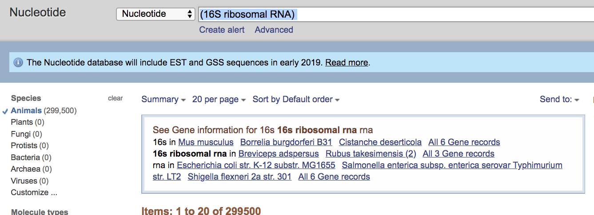

# create_classifier.md


This summarises the steps I used to create the qiime database/

#collect fasta records

I downloaded all the metazoan records for 16S as well as 


as well as all the mitochondrion sequences for a few key group of species: 
```
#GENBANK queries
mitochondrion[filter] Actinopterygii[Organism] 
mitochondrion[filter] Cnidaria[Organism] 
mitochondrion[filter] Echinodermata[Organism] 
mitochondrion[filter] cephalopoda[Organism] 
mitochondrion[filter] Porifera[Organism] 
mitochondrion[filter] Cnidaria[Organism] 
```
I concatenated both:

cat actinopterygii.fasta metazoa16S.fasta cephalopoda.fasta cnidaria.fasta cephalopoda.fasta porifera.fasta  > allrecordsncbi.fasta

All these sequences won't necessarily contains our sequence of interest but the'll be clipped(i.e. filtered) using our primers later.


### Create database format for qiime to import

I used the tool [entrez qiime] (https://github.com/bakerccm/entrez_qiime) (python2.7, accessed december 2018). I followed the pdf tutorial.


```
#get taxonomy

wget ftp://ftp.ncbi.nlm.nih.gov/pub/taxonomy/taxdump.tar.gz
tar -zxvf taxdump.tar.gz
 
ftp ftp://ftp.ncbi.nih.gov/pub/taxonomy/accession2taxid/nucl_gb.accession2taxid.gz
gunzip nucl_gb.accession2taxid.gz
```

allrecordsncbi.fasta
```
python2.7 entrez_qiime.py  --inputfasta allrecordsncbi.fasta  -o  allrecordsncbi_accession.txt
```

That way every record is matched to a taxonomy in qiime2 standard format.

### Create classifier


Ce create the classifier according to
https://docs.qiime2.org/2018.11/tutorials/feature-classifier/
```
qiime tools import \
  --type 'FeatureData[Sequence]' \
  --input-path allrecordsncbi.fasta \
  --output-path allrecordsncbi.qza


qiime tools import \
  --type 'FeatureData[Taxonomy]' \
  --input-format HeaderlessTSVTaxonomyFormat \
  --input-path allrecordsncbi_accession.txt \
  --output-path ref-taxonomy.qza
```


We then use them to create a set of raw reads to train the classifier on.


WE ARE HERE


**cephalopods**
```
qiime feature-classifier extract-reads \
  --i-sequences allrecordsncbi.qza \
  --p-f-primer TCGTCGGCAGCGTCAGATGTGTATAAGAGACAGGACGAGAAGACCCTAWTGAGCT \ ??
  --p-r-primer GTCTCGTGGGCTCGGAGATGTGTATAAGAGACAGAAATTACGCTGTTATCCCT \ ??
  --p-min-length 50 \
  --p-max-length 400 \
  --o-reads ref-seqsceph.qza
```

**chordates**
```
qiime feature-classifier extract-reads \
  --i-sequences allrecordsncbi.qza \
  --p-f-primer TCGTCGGCAGCGTCAGATGTGTATAAGAGACAGCGAGAAGACCCTRTGGAGCT  \ 
  --p-r-primer GTCTCGTGGGCTCGGAGATGTGTATAAGAGACAGTATCCTNGGTCGCCCCAAC \ 
  --p-min-length 50 \
  --p-max-length 400 \
  --o-reads ref-seqschor.qza
```
**HERE NOW, combine if needed!!**


### Verify taxonomic bredth of classifier

I want to know wether all the species suggested by Mel are in the database.

**get the sequences from the classifier**

```
qiime tools export --input-path  ref-seqschor.qza  --output-path ref-seqs
```
**Accession Mel wanted**
 cat /Users/dutlu42p/Documents/Work/projects/BruceRobertson/YEPedna/16S\ Genbank\ downloads/*/*flat  | grep ACCESSION


MATCH THEM IN CONSTRUCTION
### Train classifier

```
qiime feature-classifier fit-classifier-naive-bayes \
  --i-reference-reads ref-seqschor.qza \
  --i-reference-taxonomy  taxonomy/ref-taxonomy.qza \
  --o-classifier classifier.qza
```

Great! we now have a trained classifier.