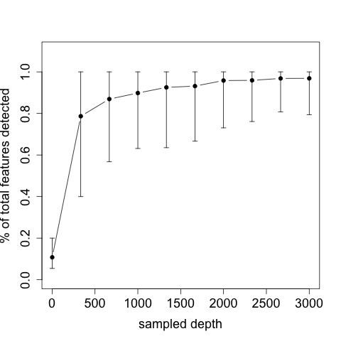

I still kept the dataset separated for the two different primer pairs.

# Step 1: Remove non-targeted taxa

I remove all data that is from non-targeted species as well as any taxa that does not reach 100 reads across all the samples.


```
#Chordates
qiime feature-table filter-features \
  --i-table table-dada2chordates.qza \
  --p-min-frequency 100 \
  --o-filtered-table sample-contingency-filtered-table.qza


 qiime taxa filter-table --p-include Actinopteri --i-table sample-contingency-filtered-table.qza --i-taxonomy taxonomy_chordates.qza --o-filtered-table table-dada2chordates100.qza --p-mode contains

#Cephalopods
###Cephalopods primers are much less specific --> softier trimming
qiime feature-table filter-features \
  --i-table table-dada2cephalo.qza \
  --p-min-frequency 50 \
  --o-filtered-table sample-contingency-filtered-table.qza


 qiime taxa filter-table --p-include cephalopoda --i-table sample-contingency-filtered-table.qza --i-taxonomy taxonomy_cephalo.qza --o-filtered-table table-dada2cephalo50.qza --p-mode contains
```

I have a look at the alpha rarefaction curves to know hww many reads is enough:


```
#Chordates

qiime diversity alpha-rarefaction \
  --i-table table-dada2chordates100.qza  \
  --p-max-depth 3000 \
  --p-steps 10 \
  --m-metadata-file  ~/repos/scripts/YEP_diet/metadata/sample_metadatarare.tsv \
  --o-visualization alpharare100chordates.qzv

#Cephalo

qiime diversity alpha-rarefaction \
  --i-table table-dada2cephalo100.qza  \
  --p-max-depth 2000 \
  --p-steps 20 \
  --m-metadata-file  ~/repos/scripts/YEP_diet/metadata/sample_metadatarare.tsv \
  --o-visualization alpharare50cephalo.qzv
```
I visualise it using [evaluatealphararechordates.R](evaluatealphararechordates.R]) from the downloaded csv out of  alpharare100chordates.qzv ass observed_otus.csv.

*Legend*:Alpha rarefaction curves for ray-finned fishes. 175 samples with more than 3000 ray-finned fishes reads were randomly sampled for different number of sequences. The y-axis represents the average percentage of the total number of independent type of sequences (i.e. QIIME 2 features) within each sample detected at each depth. The error bars represent the .



I exclude all samples that have below 2000 reads for chordates. 

```
qiime feature-table filter-samples \
  --i-table table-dada2chordates100.qza \
  --p-min-frequency 2000 \
  --o-filtered-table table-dada2chordates100min2000.qza


qiime feature-table summarize \
 --i-table table-dada2chordates100min2000.qza \
  --o-visualization table-dada2chordates100min2000.qzv

qiime taxa barplot \
  --i-table  table-dada2chordates100min2000.qza \
  --i-taxonomy taxonomy_chordates.qza \
  --m-metadata-file ~/repos/scripts/YEP_diet/metadata/sample_metadataextended.tsv \
  --o-visualization taxa-bar-plotschordates100min2000.qzv
```


## Cephalopods 

Cephalopods are trickier because the primers are not very specific and there are less sequences in general. We cannot filter them asking for that many sequences.

I lookes at the proportion of the reads that are cephalopods are as below on the non-filtered dataset(table-dada2cephalo.qzv):

```
         0%          5%         10%         15%         20%         25%
0.000177000 0.001258137 0.002971747 0.004661230 0.005942307 0.008239160
        30%         35%         40%         45%         50%         55%
0.009175671 0.011543913 0.013681838 0.016099048 0.020486459 0.022966367
        60%         65%         70%         75%         80%         85%
0.030644092 0.035074388 0.043896440 0.055172208 0.065263866 0.102529090
        90%         95%        100%
0.129002142 0.213313753 0.616515830
```

This means that the median sample in which we detect cephalopods has 1.3% of reads as cephalopods. But as you see there are many samples on which there are less than that cephalopods reads. If we want to calculate frequency of occurrence we need to only keep samples for which we are convinced we catch cephalopods, and that probably means 2 thousands reads. It is not a rarefaction curves approach but almost all samples will only have 1-2 species so that is a good way to do it!


```
qiime feature-table filter-samples \
  --i-table table-dada2cephalo.qza \
  --p-min-frequency 2000 \
  --o-filtered-table table-dada2cephalomin2000.qza

qiime feature-table filter-features \
  --i-table table-dada2cephalomin2000.qza \
  --p-min-frequency 50 \
  --o-filtered-table sample-contingency-filtered-table.qza


 qiime taxa filter-table --p-include cephalopoda --i-table sample-contingency-filtered-table.qza --i-taxonomy taxonomy_cephalo.qza --o-filtered-table table-dada2_2000ALLcephalo50.qza --p-mode contains


qiime feature-table summarize \
 --i-table table-dada2_2000ALLcephalo50.qza \
  --o-visualization table-dada2_2000ALLcephalo50.qzv

qiime taxa barplot \
  --i-table  table-dada2_2000ALLcephalo50.qza \
  --i-taxonomy taxonomy_cephalo.qza \
  --m-metadata-file ~/repos/scripts/YEP_diet/metadata/sample_metadataextended.tsv \
  --o-visualization taxa-bar-plots2000ALLcephalo50.qzv
```

That is a good dataset to calculate frequency of occurency etc so this goes into https://view.qiime2.org/ and then I download it at level 6. Then I put back in all samples that have 0 cephalopod reads but 2000 readds total from 
sample-contingency-filtered-table.qza


```

qiime feature-table summarize \
 --i-table  table-dada2cephalomin2000.qza \
  --o-visualization table-dada2cephalomin2000.qzv
```


```
#Sample list from table-dada2cephalomin2000.qzv:


all<-c("S20", "S86", "S116", "S115", "S106", "S74", "S95", "S117", "S162", "S209", "S108", "S206", "S6", "S183", "S81", "S30", "S28", "S114", "S151", "S111", "S18", "S137", "S189", "S120", "S219", "S24", "S200", "S88", "S112", "S94", "S96", "S201", "S33", "S195", "S197", "S11", "S87", "S107", "S77", "S97", "S56", "S217", "S44", "S155", "S194", "S169", "S121", "S128", "S119", "S82", "S134", "S71", "S136", "S138", "S80", "S103", "S12", "S101", "S69", "S57", "S49", "S164", "S147", "S149", "S146", "S170", "S177", "S105", "S72", "S8", "S203", "S184", "S60", "S99", "S32", "S178", "S173", "S19", "S104", "S76", "S125", "S113", "S5", "S193", "S13", "S14", "S190", "S7", "S199", "S141", "S9", "S187", "S198", "S25", "S176", "S205", "S3", "S98", "S153", "S93", "S202", "S100", "S83", "S2", "S85", "S220")

#sample list with cephalopod dataset:
indataset<-c("S100","S103","S106","S108","S111","S112","S113","S117","S119","S120","S121","S125","S134","S136","S137","S138","S146","S151","S153","S155","S164","S173","S177","S18","S183","S184","S187","S195","S198","S199","S20","S201","S202","S206","S209","S220","S25","S5","S6","S69","S77","S80","S81","S83","S85","S94","S96","S97")

#toadd, those who are not yet in dtaaset but have 2000 reeads
all[all%in%indataset==FALSE]
# [1] "S86"  "S116" "S115" "S74"  "S95"  "S162" "S30"  "S28"  "S114" "S189"
#[11] "S219" "S24"  "S200" "S88"  "S33"  "S197" "S11"  "S87"  "S107" "S56"
#[21] "S217" "S44"  "S194" "S169" "S128" "S82"  "S71"  "S12"  "S101" "S57"
#[31] "S49"  "S147" "S149" "S170" "S105" "S72"  "S8"   "S203" "S60"  "S99"
#[41] "S32"  "S178" "S19"  "S104" "S76"  "S193" "S13"  "S14"  "S190" "S7"
#[51] "S141" "S9"   "S176" "S205" "S3"   "S98"  "S93"  "S2"
```

I add them with 0s only to the final cephalopod dataset derived at level 6 and called this: cephalolevel6.csv ( with no metadata)

I then add the metadata using *addmeadatatofinal table.R* and save it as final_table_cephalo.csv


